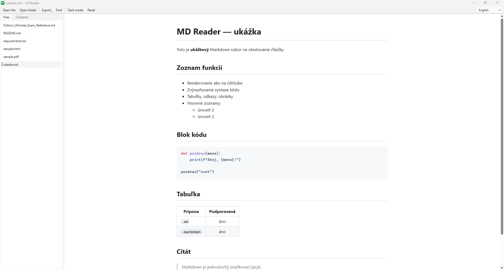

<div align="center">


# MD Reader

A lightweight, good-looking **Markdown reader for Windows**.
Double-click any `.md` file and read it rendered like on GitHub — with
syntax highlighting, tables, a dark mode and a file sidebar.



</div>

## Features

- 📄 **GitHub-style rendering** of Markdown (headings, tables, blockquotes, images, code).
- 🎨 **Syntax highlighting** for code blocks (Pygments).
- 🌗 **Light / dark theme** toggle (remembered between sessions).
- 🌍 **Multi-language UI** — English (default), Slovak, Russian and Spanish, switchable
  from the toolbar and remembered between sessions.
- 🗂️ **Switchable sidebar** — flip between the **Files** in the current folder and a
  document **Outline** (table of contents), like a PDF reader. Click any heading to jump to it.
- 🔗 **Table-of-contents links that actually work** — anchor links jump to the right
  heading regardless of which tool generated them (GitHub, VS Code, pandoc, …),
  thanks to fuzzy anchor matching.
- 🔄 **Live reload** — the view refreshes automatically when the file changes on disk.
- 🪟 **Windows integration** — installs as the default app for `.md` files and adds a Start Menu shortcut.
- 🖱️ No console window — opens cleanly on double-click.

## Requirements

- Windows 10 / 11
- [Python 3.9+](https://www.python.org/downloads/) on `PATH`

The installer pulls in the Python dependencies automatically:

| Package | Purpose |
|---------|---------|
| [PySide6](https://pypi.org/project/PySide6/) | GUI + embedded web view for rendering |
| [Markdown](https://pypi.org/project/Markdown/) | Markdown → HTML conversion |
| [Pygments](https://pypi.org/project/Pygments/) | Code syntax highlighting |

## Installation

```powershell
git clone https://github.com/<your-username>/md-reader.git
cd md-reader
powershell -ExecutionPolicy Bypass -File install.ps1
```

The installer (no admin rights needed, everything under `HKCU`):

1. Installs the Python dependencies from `requirements.txt`.
2. Generates the app icon (`mdreader.ico`).
3. Creates a no-console launcher (`run_hidden.vbs`).
4. Registers `.md`, `.markdown`, `.mdown`, `.mkd` to open with MD Reader.
5. Adds a **MD Reader** shortcut to the Start Menu.

> **Note on the default app:** Windows protects the default-app choice, so it may
> ask you to confirm once. If `.md` files don't open in MD Reader automatically:
> right-click a `.md` file → **Open with** → **Choose another app** → pick
> **MD Reader** and tick *Always use this app*.

## Usage

- **Double-click** any `.md` file, or
- launch **MD Reader** from the Start Menu, then open a file/folder.

| Shortcut | Action |
|----------|--------|
| `Ctrl+O` | Open file |
| `Ctrl+Shift+O` | Open folder |
| `Ctrl+D` | Toggle dark mode |
| `Ctrl+B` | Toggle sidebar |

You can also run it directly without installing:

```powershell
python md_reader.py path\to\file.md
```

## Uninstall

```powershell
powershell -ExecutionPolicy Bypass -File uninstall.ps1
```

This removes the file associations and the Start Menu shortcut. To also remove the
Python packages:

```powershell
python -m pip uninstall PySide6 Markdown Pygments
```

## Project structure

```
md-reader/
├─ md_reader.py       # the application
├─ install.ps1        # installer (deps + file association + shortcut)
├─ uninstall.ps1      # removes associations & shortcut
├─ make_icon.ps1      # generates mdreader.ico
├─ requirements.txt   # Python dependencies
├─ ukazka.md          # sample Markdown file
└─ assets/            # icon & screenshot for this README
```

## License

Released under the [MIT License](LICENSE).
